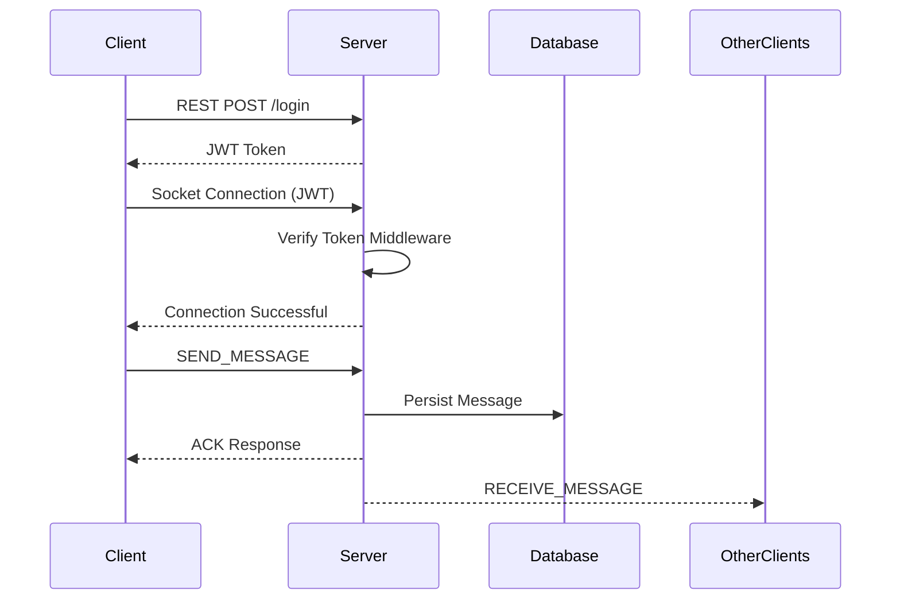

# Realtime Chat Application

A production-oriented realtime messaging platform built with **React Native**, **Expo**, **Socket.io**, and **Node.js**.
The project focuses heavily on **mobile UX**, **scalable architecture**, **type-safe communication**, and **realtime performance optimization**.

---

# Preview

> Add screenshots of the application here

- Login Screen
- Chat Interface
- Typing Indicator
- Message Delivery Status
- Realtime Messaging Flow

---

# Architecture Overview

The application follows a clean client-server realtime architecture.

```text
React Native Client
        │
        ├── REST API (Authentication + Message History)
        │
        └── Socket.io (Realtime Events)
                    │
              Express Server
                    │
                MongoDB
```

The frontend handles rendering, optimistic updates, and realtime socket events, while the backend manages authentication, persistence, and event broadcasting.

---

# Features

## Realtime Messaging

- Instant bidirectional messaging using WebSockets
- Live message broadcasting across connected clients
- Automatic socket reconnection handling

## Authentication

- JWT-based authentication system
- Protected REST APIs and socket connections
- Persistent login session using AsyncStorage

## Optimistic UI

- Messages render instantly before server acknowledgment
- Temporary client-side IDs replaced after successful ACK response
- Zero perceived latency for message sending

## Delivery Status Tracking

WhatsApp-style delivery states:

- Sending
- Sent
- Failed

## Typing Indicators

- Debounced typing events
- Realtime typing status updates between users
- Optimized to prevent excessive socket emissions

## Infinite Chat History

- Message persistence using MongoDB
- Historical messages fetched automatically on app load
- Dynamic date separators for improved readability

## Mobile UX Optimizations

- Keyboard-safe layout handling
- Smooth auto-scroll behavior
- FlatList virtualization for large conversations
- Cross-platform support for Android and iOS

---

# Tech Stack

| Layer            | Technology                  | Purpose                              |
| ---------------- | --------------------------- | ------------------------------------ |
| Frontend         | React Native + Expo         | Cross-platform mobile application    |
| Backend          | Node.js + Express           | REST API and server logic            |
| Realtime         | Socket.io                   | Realtime bidirectional communication |
| Database         | MongoDB                     | Persistent data storage              |
| Authentication   | JWT                         | Secure user authentication           |
| State Management | React Hooks                 | Local state management               |
| Monorepo         | Turborepo + Yarn Workspaces | Shared architecture management       |
| Language         | TypeScript                  | End-to-end type safety               |

---

# Monorepo Structure

```text
/
├── apps/
│   ├── mobile/          # React Native Expo application
│   └── server/          # Express + Socket.io backend
│
├── packages/
│   └── shared/          # Shared types, constants, and socket events
│
└── package.json
```

The monorepo architecture allows shared TypeScript contracts between the frontend and backend, eliminating schema mismatches during realtime communication.

---

# Realtime Event Flow



---

# Setup Instructions

## 1. Clone Repository

```bash
git clone <your_repository_url>
cd <repository_name>
```

---

## 2. Install Dependencies

```bash
npm install
```

---

## 3. Configure Environment Variables

### Backend (`/apps/server/.env`)

```env
MONGODB_URI=your_mongodb_connection_string
PORT=5000
JWT_SECRET=your_secret_key
CLIENT_URL=*
```

### Mobile App (`/apps/mobile/.env`)

#### When Using Deployed Backend

```env
EXPO_PUBLIC_API_URL=https://your_live_backend_url
EXPO_PUBLIC_SOCKET_URL=https://your_live_backend_url
```

#### When Running Backend Locally

```env
EXPO_PUBLIC_API_URL=http://localhost:5000
EXPO_PUBLIC_SOCKET_URL=http://localhost:5000
```

---

## 4. Start Backend Server

```bash
npm run server
```

---

## 5. Start Mobile Application

```bash
cd apps/mobile
npx expo start -c
```

---

# Live Backend

https://server-production-72fe.up.railway.app

---

# Demo Video

Note:
The demonstration was recorded on two separate physical devices and later merged into a single video. Due to upload limitations on the Loom free plan, the final video has been shared using Google Drive.

Video Link:
https://drive.google.com/file/d/1z1DRg2t6ewziz78cCG-RBdFdrCE9Aqki/view?usp=drive_link

---

# APK Download

APK Link:
https://drive.google.com/file/d/1ZVDpMIJTixePiqc9yG5xNkrBSte9Ory0/view?usp=drive_link

---

# Test Credentials

## User 1

```text
Username: alex
Password: 123456
```

## User 2

```text
Username: taher
Password: 123456
```

---

# Scalability & Performance Optimizations

## Singleton Socket Architecture

A centralized socket service ensures only one active socket connection exists across the application lifecycle, preventing duplicate listeners and unnecessary reconnects.

## Shared Event Contracts

Socket events and payloads are shared through the `/packages/shared` workspace, enabling strict type safety between frontend and backend.

## Optimistic Rendering

Messages are rendered immediately on the client while awaiting server acknowledgment, significantly improving perceived responsiveness.

## FlatList Virtualization

The chat UI leverages:

- `React.memo`
- Custom comparison functions
- Optimized FlatList configurations

This allows smooth rendering of large conversations containing thousands of messages.

## Debounced Typing Events

Typing events are throttled using refs and timers to reduce unnecessary server traffic during rapid keyboard input.

## Clean Separation of Concerns

Business logic is abstracted into:

- services/
- hooks/
- utils/

keeping screens lightweight and maintainable.

---

# Project Highlights

- Production-style monorepo architecture
- Fully typed realtime communication
- Mobile-first UX optimizations
- JWT-secured sockets and APIs
- Realtime typing indicators
- Optimistic UI architecture
- Persistent chat history
- Enterprise-grade folder structure

---

# Assignment Requirements Coverage

## Authentication

- JWT login system
- Persistent sessions
- Secure socket authentication
- Logout handling

## Realtime Communication

- Socket.io integration
- Live messaging
- Realtime updates
- Reconnection handling

## Chat History

- Persistent MongoDB storage
- History fetching on startup
- Dynamic rendering

## Mobile UX

- Keyboard-safe layouts
- Auto-scroll behavior
- Loading indicators
- Custom splash screen and app icon

---

# Future Improvements

Potential enhancements for production scale:

- End-to-end encryption
- Push notifications
- Read receipts
- Group chat support
- Media uploads
- Redis socket adapter for horizontal scaling
- Offline message queue
- Docker deployment
- CI/CD pipelines

---

# License

This project was created as part of a React Native technical assignment and is intended for evaluation and educational purposes.
