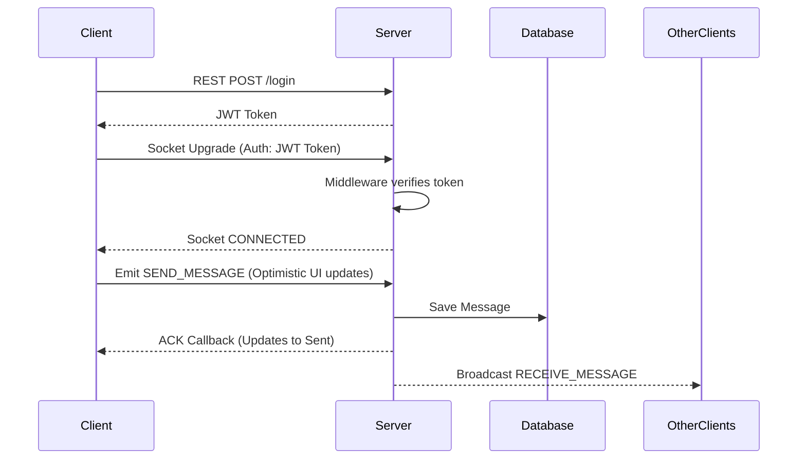

# Realtime Chat Application

A high-performance, real-time messaging system built with React Native and Socket.io. This project is engineered with a strict focus on mobile UX, offline-resilient architecture, and enterprise-grade scalability. 

[Insert Professional Screenshot Here]

## Architecture

At a high level, the system separates the client-side rendering layer from a real-time event-driven Node.js backend. 

Mobile Client (React Native) 
-> REST API (Authentication & Message History)
-> Socket.io (Bi-directional Real-Time Events)
-> Express Server 
-> MongoDB (Persistence)

## Features

- Real-Time Messaging: Instant message delivery and receiving via WebSockets.
- Optimistic UI: Messages instantly appear on the screen before the server acknowledges them.
- Message Delivery Status: WhatsApp-style delivery tracking (sending, sent, failed).
- Typing Indicators: Real-time debounced typing events broadcasted to active users.
- Smart Layout Virtualization: Custom layout architecture handling keyboard lifecycle natively across iOS and Android without third-party libraries.
- Secure Authentication: JWT-based access control governing both REST APIs and Socket handshakes.
- Infinite Scroll History: Fetched message history grouped by dynamic date separators.

## Tech Stack

| Layer | Technology | Purpose |
| --- | --- | --- |
| Frontend | React Native / Expo | Cross-platform mobile client |
| Backend | Node.js / Express | REST API and server logic |
| Realtime | Socket.io | Bi-directional communication |
| Database | MongoDB | Persistent storage |
| State Management | React Hooks | Local UI state |
| Monorepo | Turborepo / Yarn | Workspace management |

## Monorepo Structure

The project utilizes a strict monorepo architecture to share types and constants across the stack.

```text
/
├── apps/
│   ├── mobile/          (React Native Expo client)
│   └── server/          (Express + Socket.io backend)
├── packages/
│   └── shared/          (Shared Typescript interfaces & socket events)
└── package.json         (Root workspace configuration)
```

## Realtime Flow

Authentication and event lifecycle diagram:



## Setup Instructions

1. Clone the repository.
2. Install dependencies at the workspace root:
   ```bash
   npm install
   ```
3. Start the backend server:
   ```bash
   npm run server
   ```
4. Start the mobile application:
   ```bash
   cd apps/mobile && npx expo start -c
   ```

## Environment Variables

Server (.env):
- PORT: Port for the Express server (default 3000)
- MONGODB_URI: Connection string for MongoDB
- JWT_SECRET: Secret key for signing tokens

Mobile (.env):
- EXPO_PUBLIC_API_URL: HTTP endpoint for REST endpoints
- EXPO_PUBLIC_SOCKET_URL: WebSocket endpoint for Socket.io

## Demo Video

[Insert Demo Video Link Here]

## APK Download

[Insert Production APK Download Link Here]

## Scalability Notes

This application implements several production-grade optimization patterns to ensure stability at scale:

- Singleton Socket Service: Network connections are managed by a dedicated singleton service, preventing multiple socket instances across React re-renders.
- Shared Event Contracts: Both the client and server strictly type-check their event payloads using a shared `/packages` directory, preventing runtime schema mismatches.
- Optimistic UI & Acknowledgments: User actions render instantly on the client using temporary IDs, deferring to server-side Socket acknowledgments to resolve their final state, resulting in zero perceived latency.
- Memoized FlatList: The chat interface utilizes `React.memo` with a custom deep-comparison function to ensure that only messages with changing statuses or content re-render. Coupled with strict FlatList virtualization props, this enables the client to render 10,000+ messages without memory leaks.
- Debounced Typing: Input events are debounced using mutable refs, ensuring the server isn't flooded with `START_TYPING` events on every keystroke.
